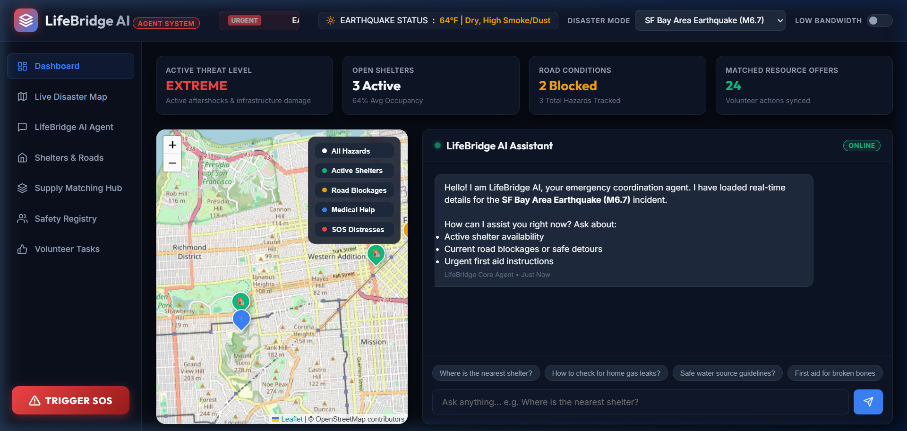
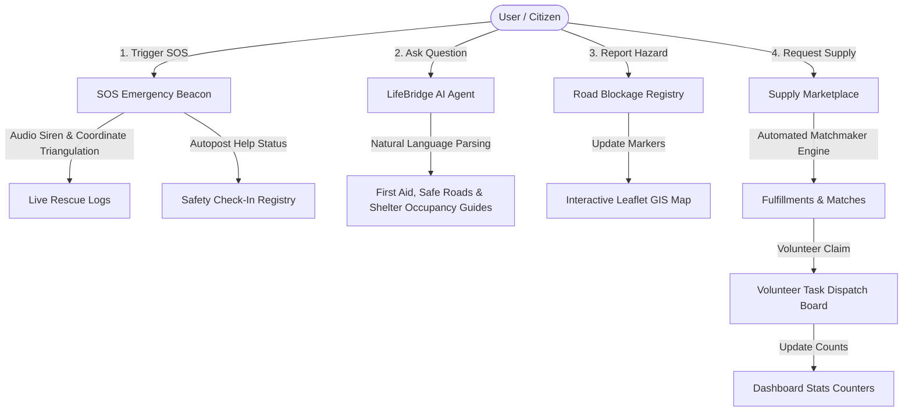

# LifeBridge AI – Emergency Response & Disaster Assistant

**Track:** Agents for Good  
**Target Region:** India (Mumbai, Odisha, Uttarakhand, Yamuna Expressway)

LifeBridge AI is an advanced, high-fidelity web application designed to assist citizens and disaster management teams during severe weather and emergency events in India. By combining an interactive mapping system, a local offline-capable database, volunteer task coordination, supply matchmaking, and a natural language AI agent, LifeBridge AI bridges the critical information gap during crises when connectivity is low and decisions must be fast.

---

## 📌 Project Demo Screenshot
Below is a preview of the main interactive dashboard showing the active Mumbai flash flooding monitoring, road blockages, open shelters, and the AI agent chat assistant:



---

## 🏗️ System Workflow & Architecture
This diagram outlines how LifeBridge AI coordinates distress signals, resources, and reports:



---

## 🌟 Key Features

1. **Multi-Disaster Indian Scenarios:**
   - **Mumbai Monsoon Flash Floods:** Monitor subways (like Andheri East), high-tides, and KEM/Sion hospital waiting times.
   - **Odisha Cyclone (Severe):** Coastal evacuation details, Puri shelters, and storm surge warnings.
   - **Uttarakhand Cloudburst & Landslide:** High-altitude valley camps, NH-58 highway blockages, and helicopter staging points.
   - **Yamuna Expressway Major Accident:** Winter fog alerts, multi-car pileups, and emergency toxicology/burn hospital status.

2. **Low-Bandwidth / Offline Cache Mode:**
   - In low-connectivity environments, toggling this mode disables Leaflet map tile downloads to preserve cellular data. 
   - It replaces the interactive map canvas with a fast, static text coordinates registry listing GPS points for shelters and hospitals.

3. **SOS Distress Beacon with Siren Synth:**
   - Triggering SOS starts a 5-second countdown accompanied by a synthetic siren warning generated natively using the Web Audio API.
   - Triangulates simulated coordinates, logs dispatch signals, and publishes the user's details to the safety directory for evacuation teams.

4. **LifeBridge AI Conversation Agent:**
   - A client-side natural language processor answering questions such as *"Where is the nearest shelter?"*, *"How to treat a burn?"*, or *"Is Andheri Subway open?"*.
   - Suggests specific routes, lists occupancy metrics, and guides home-level safety.

5. **Supply Matchmaking Board:**
   - Matchmaking algorithm automatically matches local requests (e.g. "Insulin vials") with community offers (e.g. "Thermal blankets") by category and logs coordination.

6. **Volunteer Dispatch Board:**
   - Lists tasks mapped by coordinates. Citizens can claim tasks in real time, updating the master dashboard statistics.

---

## 🛠️ Technology Stack
- **Core Layout:** Semantic HTML5, Vanilla JavaScript (ES6+).
- **Styling:** Custom CSS3 with glassmorphic cards, pulse glow animations, custom scrollbars, and dark mode theme.
- **Mapping:** Leaflet.js linked with OpenStreetMap.
- **Tooling/Server:** Vite dev server.

---

## 🚀 Setup & Running Locally

### Prerequisites
Make sure you have [Node.js](https://nodejs.org/) installed.

### 1. Clone & Install Dependencies
```bash
# Navigate to project directory
cd lifebridge-ai

# Install dependencies (Vite)
npm install
```

### 2. Run the Development Server
```bash
npm run dev
```

### 3. Build for Production
```bash
npm run build
```
The compiled static assets will be outputted to the `dist/` directory, ready to serve on any web hosting provider.
