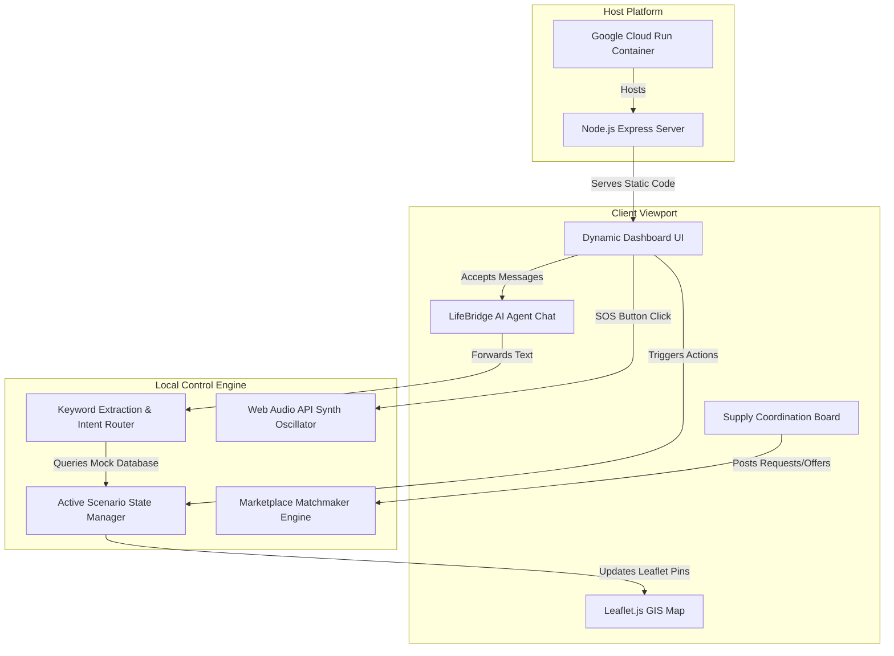
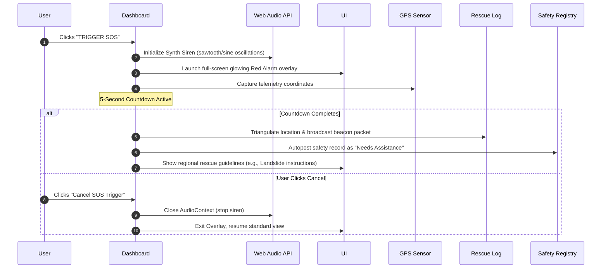
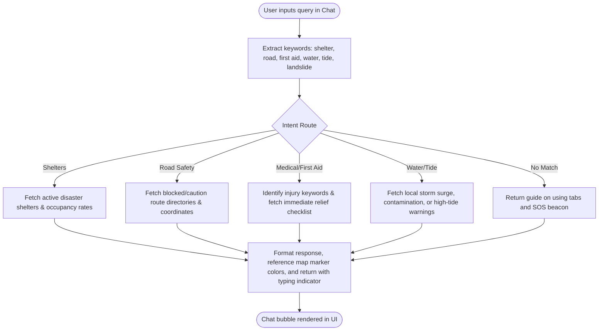
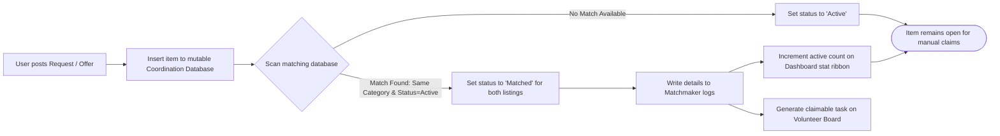
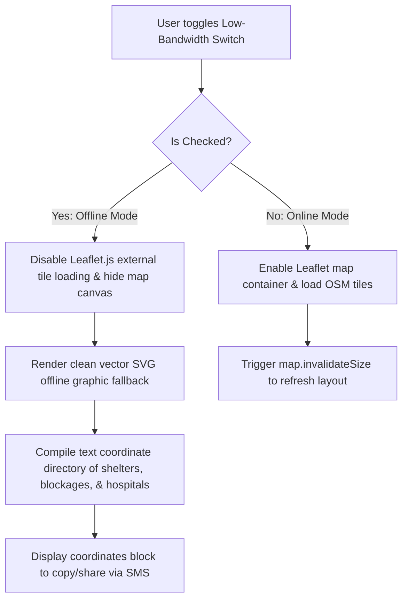

# LifeBridge AI – Project Overview & Flow Diagrams

LifeBridge AI is an Emergency Response and Disaster Assistant engineered specifically for the "Agents for Good" track. The system focuses on resolving critical coordinate gaps and information blockages during extreme crises in India:
1. **Mumbai Monsoon Flash Floods** (Severe urban flooding & high-tide constraints)
2. **Odisha Cyclone** (Extremely severe coastal wind landfall & evacuations)
3. **Uttarakhand Cloudburst & Landslide** (Mountain rockfalls, highway closures, and hypothermia hazards)
4. **Yamuna Expressway Major Accident** (Highway fog pileups, chemical spill perimeters, and emergency ward waiting times)

---

## 🏗️ System Architecture
The application runs on a clean, modern single-page frontend served via an Express.js static wrapper on Google Cloud Run. 

---

## 🔄 Detailed Flow Diagrams

### 1. SOS Distress & Broadcast Flow
This flow represents the timeline when a user triggers the SOS distress mode during an active emergency:

### 2. LifeBridge AI NLP Agent Query Flow
This workflow demonstrates how the simulated AI Agent parses user queries and extracts insights from the active disaster state database:

### 3. Supply Coordination & Matchmaking Flow
The marketplace enables citizens to ask for supplies and volunteers to fulfill needs. The backend matchmaking engine runs real-time matching checks:

### 4. Low-Bandwidth/Offline Mode Flow
When grid power or cell signals fail, the low-bandwidth switch optimizes data utilization:

